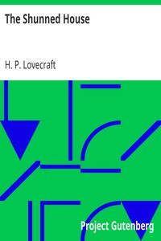

# The Shunned House <kbd>v2.2.1</kbd>

## Authors

 - Lovecraft, H. P. (Howard Phillips) <small>(1890 - 1937)</small>

## Translators

## Subjects

 - Haunted houses
 - Horror tales, American

## Readablility

 - **A1:** 70%
 - **A2:** 77%
 - **B1:** 83%
 - **B2:** 91%
 - **C1:** 97%
 - **C2:** 100%

## Words Count

 - **A1:** 432
 - **A2:** 326
 - **B1:** 436
 - **B2:** 593
 - **C1:** 533
 - **C2:** 309

## Source

<kbd>GUTHENBURGE:31469</kbd>
