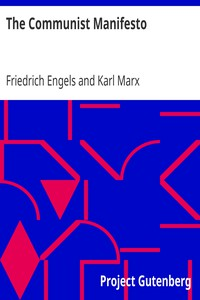

# The Communist Manifesto <kbd>v2.3.0</kbd>

## Authors

 - Engels, Friedrich <small>(1820 - 1895)</small>
 - Marx, Karl <small>(1818 - 1883)</small>

## Translators

## Subjects

 - Communism
 - Socialism

## Readablility

 - **A1:** 66%
 - **A2:** 73%
 - **B1:** 82%
 - **B2:** 89%
 - **C1:** 95%
 - **C2:** 100%

## Words Count

 - **A1:** 370
 - **A2:** 235
 - **B1:** 365
 - **B2:** 466
 - **C1:** 427
 - **C2:** 263

## Source

<kbd>GUTHENBURGE:61</kbd>
