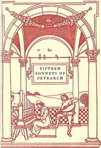

# Fifteen sonnets of Petrarch <kbd>v2.2.1</kbd>

## Authors

 - Petrarca, Francesco <small>(1304 - 1374)</small>

## Translators

 - Higginson, Thomas Wentworth <small>(1823 - 1911)</small>

## Subjects

 - Italian poetry
 - Petrarca, Francesco, 1304-1374

## Readablility

 - **A1:** 72%
 - **A2:** 78%
 - **B1:** 85%
 - **B2:** 92%
 - **C1:** 97%
 - **C2:** 100%

## Words Count

 - **A1:** 381
 - **A2:** 205
 - **B1:** 277
 - **B2:** 355
 - **C1:** 292
 - **C2:** 159

## Source

<kbd>GUTHENBURGE:50307</kbd>
