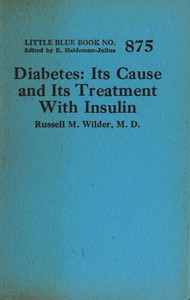

# Diabetes: Its Cause and Its Treatment With Insulin <kbd>v2.3.0</kbd>

## Authors

 - Wilder, Russell M. (Russell Morse) <small>(1885 - 1959)</small>

## Translators

## Subjects

 - Diabetes
 - Insulin

## Readablility

 - **A1:** 70%
 - **A2:** 76%
 - **B1:** 83%
 - **B2:** 91%
 - **C1:** 97%
 - **C2:** 100%

## Words Count

 - **A1:** 373
 - **A2:** 243
 - **B1:** 352
 - **B2:** 451
 - **C1:** 391
 - **C2:** 234

## Source

<kbd>GUTHENBURGE:68032</kbd>
