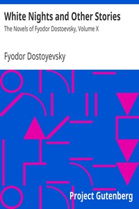

# White Nights and Other Stories: The Novels of Fyodor Dostoevsky, Volume X <kbd>v2.2.1</kbd>

## Authors

 - Dostoyevsky, Fyodor <small>(1821 - 1881)</small>

## Translators

 - Garnett, Constance <small>(1861 - 1946)</small>

## Subjects

 - Dostoyevsky, Fyodor, 1821-1881
 - Russian fiction

## Readablility

 - **A1:** 79%
 - **A2:** 85%
 - **B1:** 90%
 - **B2:** 94%
 - **C1:** 98%
 - **C2:** 100%

## Words Count

 - **A1:** 491
 - **A2:** 478
 - **B1:** 873
 - **B2:** 1407
 - **C1:** 1709
 - **C2:** 1138

## Source

<kbd>GUTHENBURGE:36034</kbd>
