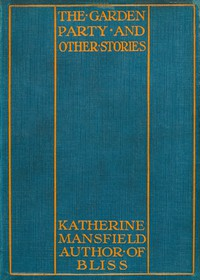

# The Garden Party, and Other Stories <kbd>v2.3.0</kbd>

## Authors

 - Mansfield, Katherine <small>(1888 - 1923)</small>

## Translators

## Subjects

 - New Zealand
 - Short stories, New Zealand

## Readablility

 - **A1:** 77%
 - **A2:** 83%
 - **B1:** 89%
 - **B2:** 94%
 - **C1:** 98%
 - **C2:** 100%

## Words Count

 - **A1:** 485
 - **A2:** 420
 - **B1:** 664
 - **B2:** 916
 - **C1:** 995
 - **C2:** 642

## Source

<kbd>GUTHENBURGE:1429</kbd>
