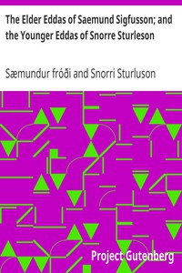

# The Elder Eddas of Saemund Sigfusson; and the Younger Eddas of Snorre Sturleson <kbd>v2.3.0</kbd>

## Authors

 - Snorri Sturluson <small>(-1 - 1241)</small>
 - Sæmundur fróði <small>(1056 - 1133)</small>

## Translators

 - Thorpe, Benjamin <small>(1782 - 1870)</small>
 - Blackwell, I. A. <small>(-1 - -1)</small>

## Subjects

 - Mythology, Norse
 - Scalds and scaldic poetry

## Readablility

 - **A1:** 76%
 - **A2:** 82%
 - **B1:** 87%
 - **B2:** 93%
 - **C1:** 97%
 - **C2:** 100%

## Words Count

 - **A1:** 491
 - **A2:** 441
 - **B1:** 812
 - **B2:** 1195
 - **C1:** 1393
 - **C2:** 997

## Source

<kbd>GUTHENBURGE:14726</kbd>
