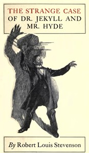

# The Strange Case of Dr. Jekyll and Mr. Hyde <kbd>v2.0.7</kbd>

## Authors

 - Stevenson, Robert Louis <small>(1850 - 1894)</small>

## Translators

## Subjects

 - Horror tales
 - London (England)
 - Multiple personality
 - Physicians
 - Psychological fiction
 - Science fiction
 - Self-experimentation in medicine

## Readablility

 - **A1:** 69%
 - **A2:** 75%
 - **B1:** 81%
 - **B2:** 87%
 - **C1:** 88%
 - **C2:** 100%

## Words Count

 - **A1:** 665
 - **A2:** 443
 - **B1:** 609
 - **B2:** 717
 - **C1:** 216
 - **C2:** 1699

## Source

<kbd>GUTHENBURGE:43</kbd>
