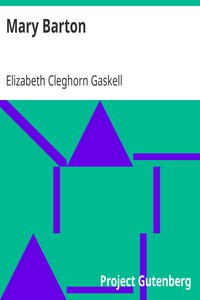

# Mary Barton <kbd>v2.2.1</kbd>

## Authors

 - Gaskell, Elizabeth Cleghorn <small>(1810 - 1865)</small>

## Translators

## Subjects

 - Domestic fiction
 - Fathers and daughters
 - Labor unions
 - Love stories
 - Manchester (England)
 - Political fiction
 - Poor families
 - Textile industry
 - Trials (Murder)
 - Triangles (Interpersonal relations)
 - Working class women

## Readablility

 - **A1:** 79%
 - **A2:** 85%
 - **B1:** 90%
 - **B2:** 95%
 - **C1:** 98%
 - **C2:** 100%

## Words Count

 - **A1:** 492
 - **A2:** 490
 - **B1:** 929
 - **B2:** 1587
 - **C1:** 2021
 - **C2:** 1398

## Source

<kbd>GUTHENBURGE:2153</kbd>
