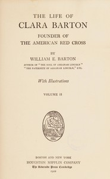

# The Life of Clara Barton, Founder of the American Red Cross (Vol. 2 of 2) <kbd>v2.3.0</kbd>

## Authors

 - Barton, William E. (William Eleazar) <small>(1861 - 1930)</small>

## Translators

## Subjects

 - American National Red Cross
 - Barton, Clara, 1821-1912
 - Nurses

## Readablility

 - **A1:** 76%
 - **A2:** 82%
 - **B1:** 88%
 - **B2:** 94%
 - **C1:** 98%
 - **C2:** 100%

## Words Count

 - **A1:** 494
 - **A2:** 494
 - **B1:** 956
 - **B2:** 1630
 - **C1:** 2100
 - **C2:** 1373

## Source

<kbd>GUTHENBURGE:67954</kbd>
