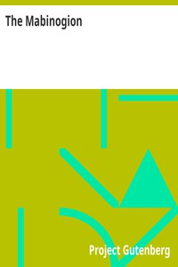

# The Mabinogion <kbd>v2.0.2</kbd>

## Authors

## Translators

 - Schreiber, Charlotte, Lady <small>(1812 - 1895)</small>

## Subjects

 - Mythology, Celtic
 - Tales
 - Welsh literature

## Readablility

 - **A1:** 54%
 - **A2:** 61%
 - **B1:** 70%
 - **B2:** 82%
 - **C1:** 85%
 - **C2:** 100%

## Words Count

 - **A1:** 532
 - **A2:** 459
 - **B1:** 725
 - **B2:** 1076
 - **C1:** 457
 - **C2:** 3813

## Source

<kbd>GUTHENBURGE:5160</kbd>
