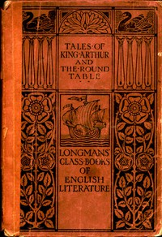

# Tales of King Arthur and the Round Table, Adapted from the Book of Romance <kbd>v2.2.1</kbd>

## Authors

## Translators

## Subjects

 - Arthur, King
 - Arthurian romances
 - Folklore
 - Knights and knighthood

## Readablility

 - **A1:** 78%
 - **A2:** 83%
 - **B1:** 88%
 - **B2:** 94%
 - **C1:** 99%
 - **C2:** 100%

## Words Count

 - **A1:** 474
 - **A2:** 373
 - **B1:** 549
 - **B2:** 664
 - **C1:** 548
 - **C2:** 198

## Source

<kbd>GUTHENBURGE:49057</kbd>
