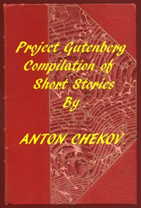

# Project Gutenberg Compilation of Short Stories by Chekhov <kbd>v2.0.2</kbd>

## Authors

 - Chekhov, Anton Pavlovich <small>(1860 - 1904)</small>

## Translators

## Subjects

 - Chekhov, Anton Pavlovich, 1860-1904
 - Russia
 - Russian fiction
 - Short stories, Russian

## Readablility

 - **A1:** 55%
 - **A2:** 61%
 - **B1:** 72%
 - **B2:** 84%
 - **C1:** 88%
 - **C2:** 100%

## Words Count

 - **A1:** 692
 - **A2:** 785
 - **B1:** 1477
 - **B2:** 2718
 - **C1:** 1297
 - **C2:** 17188

## Source

<kbd>GUTHENBURGE:57333</kbd>
