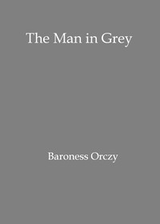

# The man in grey: Being episodes of the Chovan conspiracies in Normandy during the First Empire. <kbd>v2.3.0</kbd>

## Authors

 - Orczy, Emmuska Orczy, Baroness <small>(1865 - 1947)</small>

## Translators

## Subjects

## Readablility

 - **A1:** 75%
 - **A2:** 81%
 - **B1:** 86%
 - **B2:** 93%
 - **C1:** 97%
 - **C2:** 100%

## Words Count

 - **A1:** 490
 - **A2:** 466
 - **B1:** 808
 - **B2:** 1252
 - **C1:** 1414
 - **C2:** 1019

## Source

<kbd>GUTHENBURGE:68172</kbd>
