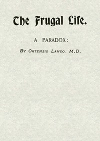

# The Frugal Life: A Paradox <kbd>v2.3.0</kbd>

## Authors

 - Landi, Ortensio <small>(-1 - -1)</small>

## Translators

## Subjects

 - Diet

## Readablility

 - **A1:** 71%
 - **A2:** 78%
 - **B1:** 86%
 - **B2:** 93%
 - **C1:** 98%
 - **C2:** 100%

## Words Count

 - **A1:** 337
 - **A2:** 163
 - **B1:** 219
 - **B2:** 261
 - **C1:** 183
 - **C2:** 79

## Source

<kbd>GUTHENBURGE:68053</kbd>
