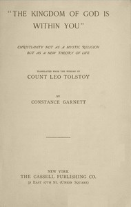

# "The Kingdom of God Is Within You": Christianity Not as a Mystic Religion but as a New Theory of Life <kbd>v2.3.0</kbd>

## Authors

 - Tolstoy, Leo, graf <small>(1828 - 1910)</small>

## Translators

 - Garnett, Constance <small>(1861 - 1946)</small>

## Subjects

 - Christianity
 - Christianity
 - Government, Resistance to
 - Nonviolence

## Readablility

 - **A1:** 75%
 - **A2:** 81%
 - **B1:** 87%
 - **B2:** 94%
 - **C1:** 98%
 - **C2:** 100%

## Words Count

 - **A1:** 487
 - **A2:** 461
 - **B1:** 830
 - **B2:** 1335
 - **C1:** 1663
 - **C2:** 1129

## Source

<kbd>GUTHENBURGE:43302</kbd>
