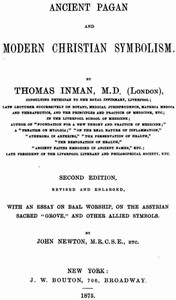

# Ancient Pagan and Modern Christian Symbolism: With an Essay on Baal Worship, on the Assyrian Sacred "Grove," and Other Allied Symbols <kbd>v2.2.1</kbd>

## Authors

 - Inman, Thomas <small>(1820 - 1876)</small>
 - Newton, John, M.R.C.S.E. <small>(-1 - -1)</small>

## Translators

## Subjects

 - Christian art and symbolism
 - Symbolism

## Readablility

 - **A1:** 72%
 - **A2:** 77%
 - **B1:** 84%
 - **B2:** 90%
 - **C1:** 96%
 - **C2:** 99%

## Words Count

 - **A1:** 478
 - **A2:** 397
 - **B1:** 644
 - **B2:** 877
 - **C1:** 950
 - **C2:** 660

## Source

<kbd>GUTHENBURGE:38485</kbd>
