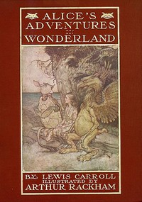

# Alice's Adventures in Wonderland: Illustrated by Arthur Rackham. With a Proem by Austin Dobson <kbd>v2.0.2</kbd>

## Authors

 - Carroll, Lewis <small>(1832 - 1898)</small>

## Translators

## Subjects

 - Alice (Fictitious character from Carroll)
 - Children's stories
 - Fantasy fiction
 - Imaginary places

## Readablility

 - **A1:** 54%
 - **A2:** 61%
 - **B1:** 72%
 - **B2:** 85%
 - **C1:** 89%
 - **C2:** 100%

## Words Count

 - **A1:** 462
 - **A2:** 324
 - **B1:** 506
 - **B2:** 642
 - **C1:** 246
 - **C2:** 1054

## Source

<kbd>GUTHENBURGE:28885</kbd>
