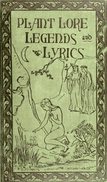

# Plant Lore, Legends, and Lyrics: Embracing the Myths, Traditions, Superstitions, and Folk-Lore of the Plant Kingdom <kbd>v2.3.0</kbd>

## Authors

 - Folkard, Richard <small>(-1 - -1)</small>

## Translators

## Subjects

 - Plants

## Readablility

 - **A1:** 71%
 - **A2:** 77%
 - **B1:** 83%
 - **B2:** 90%
 - **C1:** 95%
 - **C2:** 100%

## Words Count

 - **A1:** 495
 - **A2:** 494
 - **B1:** 968
 - **B2:** 1775
 - **C1:** 2701
 - **C2:** 2735

## Source

<kbd>GUTHENBURGE:44638</kbd>
