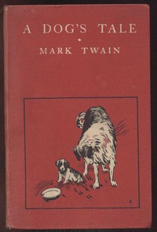

# A Dog's Tale <kbd>v2.2.1</kbd>

## Authors

 - Twain, Mark <small>(1835 - 1910)</small>

## Translators

## Subjects

 - Dogs

## Readablility

 - **A1:** 75%
 - **A2:** 81%
 - **B1:** 88%
 - **B2:** 95%
 - **C1:** 99%
 - **C2:** 100%

## Words Count

 - **A1:** 379
 - **A2:** 213
 - **B1:** 268
 - **B2:** 289
 - **C1:** 191
 - **C2:** 60

## Source

<kbd>GUTHENBURGE:3174</kbd>
