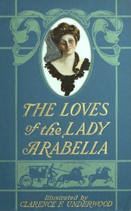

# The Loves of the Lady Arabella <kbd>v2.0.2</kbd>

## Authors

 - Seawell, Molly Elliot <small>(1860 - 1916)</small>

## Translators

## Subjects

 - Dueling
 - England
 - Great Britain. Royal Navy
 - Heiresses
 - Inheritance and succession
 - Man-woman relationships

## Readablility

 - **A1:** 53%
 - **A2:** 61%
 - **B1:** 70%
 - **B2:** 83%
 - **C1:** 86%
 - **C2:** 100%

## Words Count

 - **A1:** 524
 - **A2:** 459
 - **B1:** 755
 - **B2:** 1084
 - **C1:** 440
 - **C2:** 2460

## Source

<kbd>GUTHENBURGE:68033</kbd>
