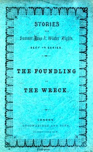

# The Foundling of the Wreck <kbd>v2.2.1</kbd>

## Authors

 - Anonymous <small>(-1 - -1)</small>

## Translators

## Subjects

 - Biographical fiction
 - Children
 - Christian life
 - Conduct of life
 - Foundlings
 - Kings and rulers
 - Peter I, Emperor of Russia, 1672-1725
 - Russia
 - Slaves

## Readablility

 - **A1:** 75%
 - **A2:** 81%
 - **B1:** 88%
 - **B2:** 95%
 - **C1:** 99%
 - **C2:** 100%

## Words Count

 - **A1:** 450
 - **A2:** 315
 - **B1:** 468
 - **B2:** 530
 - **C1:** 383
 - **C2:** 109

## Source

<kbd>GUTHENBURGE:68050</kbd>
