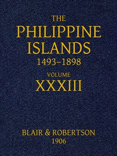

# The Philippine Islands, 1493-1898, Volume 33, 1519-1522: Explorations by early navigators, descriptions of the islands and their peoples, their history and records of the Catholic missions, as related in contemporaneous books and manuscripts, showing the political, economic, commercial and religious conditions of those islands from their earliest relations with European nations to the close of the nineteenth century <kbd>v2.2.1</kbd>

## Authors

 - Pigafetta, Antonio <small>(-1 - -1)</small>

## Translators

 - Robertson, James Alexander <small>(1873 - 1939)</small>

## Subjects

 - Demarcation line of Alexander VI
 - Missions
 - Philippines
 - Philippines

## Readablility

 - **A1:** 77%
 - **A2:** 83%
 - **B1:** 88%
 - **B2:** 92%
 - **C1:** 97%
 - **C2:** 100%

## Words Count

 - **A1:** 483
 - **A2:** 443
 - **B1:** 735
 - **B2:** 1008
 - **C1:** 1079
 - **C2:** 735

## Source

<kbd>GUTHENBURGE:42884</kbd>
