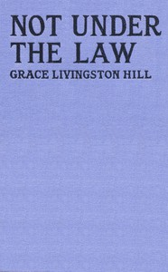

# Not Under the Law <kbd>v2.0.2</kbd>

## Authors

 - Hill, Grace Livingston <small>(1865 - 1947)</small>

## Translators

## Subjects

 - Christian fiction
 - Love stories
 - Man-woman relationships
 - Nineteen twenties
 - Young women

## Readablility

 - **A1:** 56%
 - **A2:** 64%
 - **B1:** 74%
 - **B2:** 86%
 - **C1:** 90%
 - **C2:** 100%

## Words Count

 - **A1:** 591
 - **A2:** 548
 - **B1:** 917
 - **B2:** 1406
 - **C1:** 594
 - **C2:** 3526

## Source

<kbd>GUTHENBURGE:67977</kbd>
