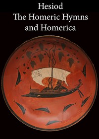

# Hesiod, the Homeric Hymns, and Homerica <kbd>v2.2.1</kbd>

## Authors

 - Hesiod <small>(-1 - -1)</small>

## Translators

 - Evelyn-White, Hugh G. (Hugh Gerard) <small>(1884 - 1924)</small>

## Subjects

 - Epic poetry, Greek
 - Epic poetry, Greek
 - Gods, Greek
 - Hesiod
 - Hymns, Greek (Classical)

## Readablility

 - **A1:** 75%
 - **A2:** 80%
 - **B1:** 86%
 - **B2:** 92%
 - **C1:** 97%
 - **C2:** 100%

## Words Count

 - **A1:** 488
 - **A2:** 445
 - **B1:** 768
 - **B2:** 1154
 - **C1:** 1357
 - **C2:** 983

## Source

<kbd>GUTHENBURGE:348</kbd>
