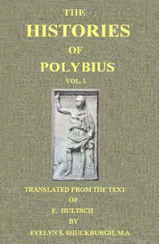

# The Histories of Polybius, Vol. 1 (of 2) <kbd>v2.3.0</kbd>

## Authors

 - Polybius <small>(-1 - -1)</small>

## Translators

 - Shuckburgh, Evelyn S. (Evelyn Shirley) <small>(1843 - 1906)</small>

## Subjects

 - History, Ancient

## Readablility

 - **A1:** 76%
 - **A2:** 82%
 - **B1:** 88%
 - **B2:** 94%
 - **C1:** 98%
 - **C2:** 100%

## Words Count

 - **A1:** 488
 - **A2:** 470
 - **B1:** 894
 - **B2:** 1546
 - **C1:** 2149
 - **C2:** 1492

## Source

<kbd>GUTHENBURGE:44125</kbd>
