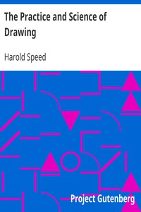

# The Practice and Science of Drawing <kbd>v2.3.0</kbd>

## Authors

 - Speed, Harold <small>(1873 - 1957)</small>

## Translators

## Subjects

 - Drawing

## Readablility

 - **A1:** 71%
 - **A2:** 79%
 - **B1:** 86%
 - **B2:** 93%
 - **C1:** 98%
 - **C2:** 100%

## Words Count

 - **A1:** 466
 - **A2:** 389
 - **B1:** 673
 - **B2:** 945
 - **C1:** 1016
 - **C2:** 631

## Source

<kbd>GUTHENBURGE:14264</kbd>
