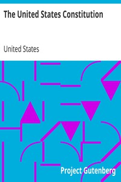

# The United States Constitution <kbd>v2.2.1</kbd>

## Authors

 - United States <small>(-1 - -1)</small>

## Translators

## Subjects

 - United States
 - United States. Constitution

## Readablility

 - **A1:** 71%
 - **A2:** 78%
 - **B1:** 85%
 - **B2:** 92%
 - **C1:** 98%
 - **C2:** 100%

## Words Count

 - **A1:** 287
 - **A2:** 146
 - **B1:** 209
 - **B2:** 246
 - **C1:** 211
 - **C2:** 79

## Source

<kbd>GUTHENBURGE:5</kbd>
