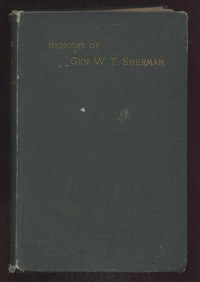

# Memoirs of General William T. Sherman — Complete <kbd>v2.3.0</kbd>

## Authors

 - Sherman, William T. (William Tecumseh) <small>(1820 - 1891)</small>

## Translators

## Subjects

 - Generals
 - Sherman, William T. (William Tecumseh), 1820-1891
 - United States
 - United States
 - United States. Army

## Readablility

 - **A1:** 74%
 - **A2:** 81%
 - **B1:** 87%
 - **B2:** 94%
 - **C1:** 98%
 - **C2:** 100%

## Words Count

 - **A1:** 492
 - **A2:** 486
 - **B1:** 948
 - **B2:** 1730
 - **C1:** 2454
 - **C2:** 1882

## Source

<kbd>GUTHENBURGE:4361</kbd>
