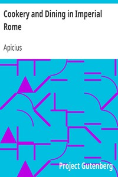

# Cookery and Dining in Imperial Rome <kbd>GUTHENBURGE</kbd>

## Authors

 - Apicius <small>(-1 - -1)</small>

## Translators

 - Vehling, Joseph Dommers <small>(1879 - 1950)</small>

## Subjects

 - Cookbooks
 - Cooking, Roman

## Readablility

 - **A1:** 36%
 - **A2:** 42%
 - **B1:** 52%
 - **B2:** 68%
 - **C1:** 72%
 - **C2:** 100%

## Words Count

 - **A1:** 539
 - **A2:** 536
 - **B1:** 890
 - **B2:** 1476
 - **C1:** 576
 - **C2:** 8377

## Tagger Version

v2.0.0
