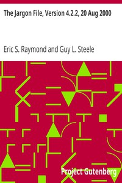

# The Jargon File, Version 4.2.2, 20 Aug 2000 <kbd>v2.2.1</kbd>

## Authors

## Translators

## Subjects

 - Computers
 - Computers
 - Electronic data processing

## Readablility

 - **A1:** 69%
 - **A2:** 74%
 - **B1:** 80%
 - **B2:** 87%
 - **C1:** 93%
 - **C2:** 99%

## Words Count

 - **A1:** 490
 - **A2:** 473
 - **B1:** 876
 - **B2:** 1426
 - **C1:** 2138
 - **C2:** 2337

## Source

<kbd>GUTHENBURGE:3008</kbd>
