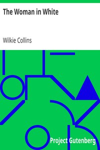

# The Woman in White <kbd>v2.3.0</kbd>

## Authors

 - Collins, Wilkie <small>(1824 - 1889)</small>

## Translators

## Subjects

 - Art teachers
 - Country homes
 - Deception
 - England
 - Gothic fiction
 - Inheritance and succession
 - Love stories
 - Nobility
 - Psychiatric hospital patients
 - Psychological fiction

## Readablility

 - **A1:** 78%
 - **A2:** 84%
 - **B1:** 90%
 - **B2:** 95%
 - **C1:** 99%
 - **C2:** 100%

## Words Count

 - **A1:** 492
 - **A2:** 484
 - **B1:** 933
 - **B2:** 1612
 - **C1:** 2256
 - **C2:** 1477

## Source

<kbd>GUTHENBURGE:583</kbd>
