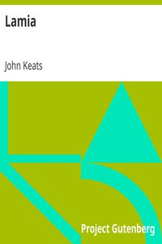

# Lamia <kbd>v2.3.0</kbd>

## Authors

 - Keats, John <small>(1795 - 1821)</small>

## Translators

## Subjects

 - English poetry

## Readablility

 - **A1:** 69%
 - **A2:** 76%
 - **B1:** 84%
 - **B2:** 91%
 - **C1:** 97%
 - **C2:** 100%

## Words Count

 - **A1:** 400
 - **A2:** 216
 - **B1:** 332
 - **B2:** 402
 - **C1:** 367
 - **C2:** 208

## Source

<kbd>GUTHENBURGE:2490</kbd>
