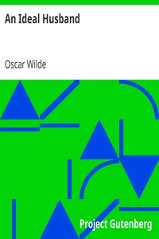

# An Ideal Husband <kbd>v2.2.1</kbd>

## Authors

 - Wilde, Oscar <small>(1854 - 1900)</small>

## Translators

## Subjects

 - Comedies
 - London (England)

## Readablility

 - **A1:** 78%
 - **A2:** 84%
 - **B1:** 90%
 - **B2:** 95%
 - **C1:** 99%
 - **C2:** 100%

## Words Count

 - **A1:** 469
 - **A2:** 377
 - **B1:** 524
 - **B2:** 644
 - **C1:** 531
 - **C2:** 220

## Source

<kbd>GUTHENBURGE:885</kbd>
