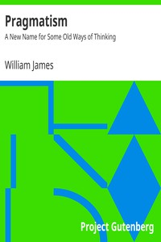

# Pragmatism: A New Name for Some Old Ways of Thinking <kbd>v2.3.0</kbd>

## Authors

 - James, William <small>(1842 - 1910)</small>

## Translators

## Subjects

 - Pragmatism

## Readablility

 - **A1:** 74%
 - **A2:** 80%
 - **B1:** 86%
 - **B2:** 92%
 - **C1:** 97%
 - **C2:** 100%

## Words Count

 - **A1:** 468
 - **A2:** 412
 - **B1:** 696
 - **B2:** 977
 - **C1:** 1058
 - **C2:** 832

## Source

<kbd>GUTHENBURGE:5116</kbd>
