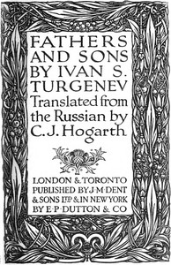

# Fathers and Sons <kbd>v2.2.1</kbd>

## Authors

 - Turgenev, Ivan Sergeevich <small>(1818 - 1883)</small>

## Translators

 - Hogarth, C. J. <small>(1869 - 1942)</small>

## Subjects

 - Domestic fiction
 - Fathers and sons
 - Historical fiction
 - Nihilism (Philosophy)
 - Russia
 - Russia

## Readablility

 - **A1:** 76%
 - **A2:** 82%
 - **B1:** 88%
 - **B2:** 93%
 - **C1:** 98%
 - **C2:** 100%

## Words Count

 - **A1:** 488
 - **A2:** 477
 - **B1:** 864
 - **B2:** 1386
 - **C1:** 1627
 - **C2:** 1172

## Source

<kbd>GUTHENBURGE:47935</kbd>
