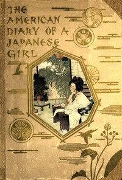

# The American Diary of a Japanese Girl <kbd>v2.3.0</kbd>

## Authors

 - Noguchi, Yoné <small>(1875 - 1947)</small>

## Translators

## Subjects

 - Japan
 - Japanese

## Readablility

 - **A1:** 73%
 - **A2:** 79%
 - **B1:** 85%
 - **B2:** 92%
 - **C1:** 97%
 - **C2:** 100%

## Words Count

 - **A1:** 486
 - **A2:** 445
 - **B1:** 699
 - **B2:** 1050
 - **C1:** 1187
 - **C2:** 714

## Source

<kbd>GUTHENBURGE:63256</kbd>
