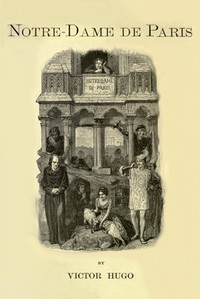

# Notre-Dame de Paris <kbd>GUTHENBURGE</kbd>

## Authors

 - Hugo, Victor <small>(1802 - 1885)</small>

## Translators

 - Hapgood, Isabel Florence <small>(1850 - 1928)</small>

## Subjects

 - Clergy
 - France
 - Historical fiction
 - Notre-Dame de Paris (Cathedral)
 - Paris (France)
 - People with disabilities
 - Romances

## Readablility

 - **A1:** 42%
 - **A2:** 55%
 - **B1:** 68%
 - **B2:** 81%
 - **C1:** 93%
 - **C2:** 100%

## Words Count

 - **A1:** 408
 - **A2:** 488
 - **B1:** 930
 - **B2:** 1620
 - **C1:** 2322
 - **C2:** 2228
