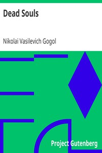

# Dead Souls <kbd>v2.3.0</kbd>

## Authors

 - Gogol, Nikolai Vasilevich <small>(1809 - 1852)</small>

## Translators

 - Hogarth, D. J. <small>(-1 - -1)</small>

## Subjects

 - Humorous stories
 - Russia
 - Satire
 - Swindlers and swindling

## Readablility

 - **A1:** 75%
 - **A2:** 81%
 - **B1:** 87%
 - **B2:** 93%
 - **C1:** 98%
 - **C2:** 100%

## Words Count

 - **A1:** 493
 - **A2:** 489
 - **B1:** 940
 - **B2:** 1645
 - **C1:** 2281
 - **C2:** 1815

## Source

<kbd>GUTHENBURGE:1081</kbd>
