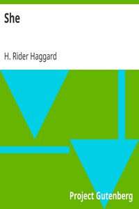

# She <kbd>v2.3.0</kbd>

## Authors

 - Haggard, H. Rider (Henry Rider) <small>(1856 - 1925)</small>

## Translators

## Subjects

 - Adventure stories
 - Africa
 - Ayesha (Fictitious character : Haggard)
 - Fantasy fiction
 - Immortalism
 - Love stories
 - Reincarnation
 - Women

## Readablility

 - **A1:** 77%
 - **A2:** 83%
 - **B1:** 89%
 - **B2:** 94%
 - **C1:** 98%
 - **C2:** 100%

## Words Count

 - **A1:** 494
 - **A2:** 484
 - **B1:** 902
 - **B2:** 1461
 - **C1:** 1723
 - **C2:** 1078

## Source

<kbd>GUTHENBURGE:3155</kbd>
