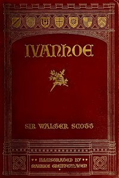

# Ivanhoe: A Romance <kbd>v2.3.0</kbd>

## Authors

 - Scott, Walter <small>(1771 - 1832)</small>

## Translators

## Subjects

 - Anglo-Saxons
 - Great Britain
 - Historical fiction
 - Ivanhoe, Wilfred of, Sir (Fictitious character)
 - Jews
 - Knights and knighthood
 - Love stories
 - Normans
 - Triangles (Interpersonal relations)

## Readablility

 - **A1:** 73%
 - **A2:** 79%
 - **B1:** 85%
 - **B2:** 92%
 - **C1:** 97%
 - **C2:** 100%

## Words Count

 - **A1:** 493
 - **A2:** 493
 - **B1:** 959
 - **B2:** 1753
 - **C1:** 2569
 - **C2:** 2116

## Source

<kbd>GUTHENBURGE:82</kbd>
