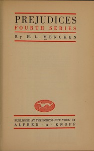

# Prejudices: Fourth Series <kbd>v2.2.1</kbd>

## Authors

 - Mencken, H. L. (Henry Louis) <small>(1880 - 1956)</small>

## Translators

## Subjects

 - American essays
 - American literature
 - Literature

## Readablility

 - **A1:** 73%
 - **A2:** 78%
 - **B1:** 84%
 - **B2:** 91%
 - **C1:** 97%
 - **C2:** 100%

## Words Count

 - **A1:** 487
 - **A2:** 451
 - **B1:** 823
 - **B2:** 1312
 - **C1:** 1651
 - **C2:** 1331

## Source

<kbd>GUTHENBURGE:67978</kbd>
