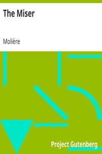

# The Miser <kbd>v2.2.1</kbd>

## Authors

 - Molière <small>(1622 - 1673)</small>

## Translators

 - Wall, Charles Heron <small>(-1 - -1)</small>

## Subjects

 - Comedies
 - Misers
 - Molière, 1622-1673

## Readablility

 - **A1:** 78%
 - **A2:** 84%
 - **B1:** 90%
 - **B2:** 94%
 - **C1:** 98%
 - **C2:** 100%

## Words Count

 - **A1:** 452
 - **A2:** 343
 - **B1:** 516
 - **B2:** 591
 - **C1:** 507
 - **C2:** 204

## Source

<kbd>GUTHENBURGE:6923</kbd>
