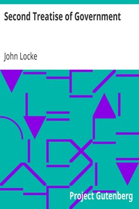

# Second Treatise of Government <kbd>v2.2.1</kbd>

## Authors

 - Locke, John <small>(1632 - 1704)</small>

## Translators

## Subjects

 - Liberty
 - Political science
 - Toleration

## Readablility

 - **A1:** 78%
 - **A2:** 83%
 - **B1:** 88%
 - **B2:** 94%
 - **C1:** 99%
 - **C2:** 100%

## Words Count

 - **A1:** 459
 - **A2:** 337
 - **B1:** 532
 - **B2:** 803
 - **C1:** 769
 - **C2:** 407

## Source

<kbd>GUTHENBURGE:7370</kbd>
