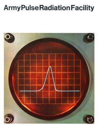

# Army Pulse Radiation Facility <kbd>v2.3.0</kbd>

## Authors

 - U.S. Army Ballistic Research Laboratory <small>(-1 - -1)</small>

## Translators

## Subjects

 - Army Pulse Radiation Facility

## Readablility

 - **A1:** 62%
 - **A2:** 69%
 - **B1:** 78%
 - **B2:** 88%
 - **C1:** 97%
 - **C2:** 100%

## Words Count

 - **A1:** 218
 - **A2:** 127
 - **B1:** 173
 - **B2:** 226
 - **C1:** 175
 - **C2:** 94

## Source

<kbd>GUTHENBURGE:68120</kbd>
