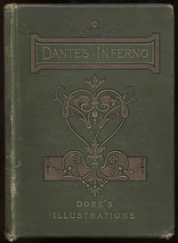

# An Index of The Divine Comedy by Dante <kbd>v2.0.2</kbd>

## Authors

 - Dante Alighieri <small>(1265 - 1321)</small>

## Translators

 - Cary, Henry Francis <small>(1772 - 1844)</small>

## Subjects

 - Epic poetry, Italian
 - Italian poetry

## Readablility

 - **A1:** 41%
 - **A2:** 47%
 - **B1:** 60%
 - **B2:** 81%
 - **C1:** 86%
 - **C2:** 100%

## Words Count

 - **A1:** 160
 - **A2:** 106
 - **B1:** 158
 - **B2:** 153
 - **C1:** 39
 - **C2:** 160

## Source

<kbd>GUTHENBURGE:8800</kbd>
