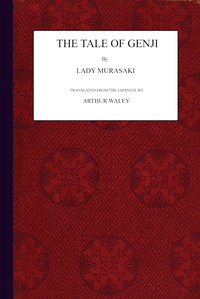

# The Tale of Genji <kbd>v2.2.1</kbd>

## Authors

 - Murasaki Shikibu <small>(-1 - -1)</small>

## Translators

 - Waley, Arthur <small>(1889 - 1966)</small>

## Subjects

 - Aristocracy (Social class)
 - Japan
 - Japan
 - Japanese fiction
 - Man-woman relationships
 - Princes

## Readablility

 - **A1:** 78%
 - **A2:** 84%
 - **B1:** 90%
 - **B2:** 95%
 - **C1:** 98%
 - **C2:** 100%

## Words Count

 - **A1:** 492
 - **A2:** 467
 - **B1:** 856
 - **B2:** 1344
 - **C1:** 1501
 - **C2:** 970

## Source

<kbd>GUTHENBURGE:66057</kbd>
