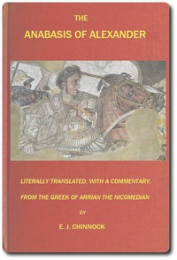

# The Anabasis of Alexander: or, The History of the Wars and Conquests of Alexander the Great <kbd>v2.0.2</kbd>

## Authors

 - Arrian <small>(-1 - -1)</small>

## Translators

 - Chinnock, Edward James <small>(-1 - -1)</small>

## Subjects

 - Alexander, the Great, 356 B.C.-323 B.C.
 - India
 - Iran

## Readablility

 - **A1:** 49%
 - **A2:** 56%
 - **B1:** 65%
 - **B2:** 78%
 - **C1:** 81%
 - **C2:** 100%

## Words Count

 - **A1:** 552
 - **A2:** 519
 - **B1:** 893
 - **B2:** 1345
 - **C1:** 575
 - **C2:** 6189

## Source

<kbd>GUTHENBURGE:46976</kbd>
