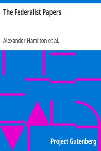

# The Federalist Papers <kbd>v2.0.2</kbd>

## Authors

 - Hamilton, Alexander <small>(1757 - 1804)</small>
 - Madison, James <small>(1751 - 1836)</small>
 - Jay, John <small>(1745 - 1829)</small>

## Translators

## Subjects

 - Constitutional history
 - Constitutional law

## Readablility

 - **A1:** 52%
 - **A2:** 60%
 - **B1:** 72%
 - **B2:** 87%
 - **C1:** 91%
 - **C2:** 100%

## Words Count

 - **A1:** 530
 - **A2:** 570
 - **B1:** 945
 - **B2:** 1577
 - **C1:** 639
 - **C2:** 4549

## Source

<kbd>GUTHENBURGE:1404</kbd>
