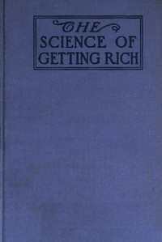

# The Science of Getting Rich <kbd>v2.3.0</kbd>

## Authors

 - Wattles, W. D. <small>(1860 - 1911)</small>

## Translators

## Subjects

 - New Thought
 - Success
 - Wealth

## Readablility

 - **A1:** 76%
 - **A2:** 83%
 - **B1:** 89%
 - **B2:** 95%
 - **C1:** 99%
 - **C2:** 100%

## Words Count

 - **A1:** 431
 - **A2:** 300
 - **B1:** 439
 - **B2:** 593
 - **C1:** 468
 - **C2:** 225

## Source

<kbd>GUTHENBURGE:59844</kbd>
